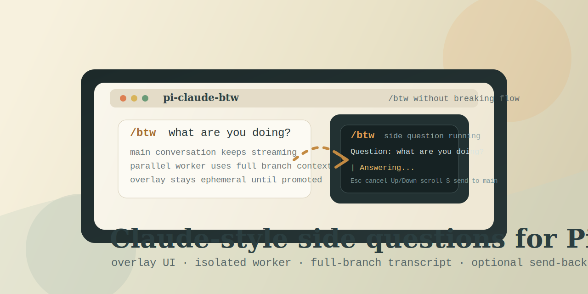

# pi-claude-btw



`pi-claude-btw` brings a Claude Code-style `/btw` command to Pi: ask a side question, keep the main conversation moving, and get the answer in an overlay instead of polluting the main transcript.

## Why this package exists

Claude Code's `/btw` is useful because it feels lightweight:

- ask a quick side question without derailing the main thread
- keep the answer visually separate
- reuse current conversation context
- optionally bring the answer back only when it is worth promoting

This package recreates that workflow for Pi with a standalone installable extension.

## Highlights

- immediate overlay UI via `ctx.ui.custom(..., { overlay: true })`
- isolated one-shot `pi` subprocess worker
- full current-branch transcript capture from `ctx.sessionManager.getBranch()`
- no built-in tools in the side-question worker
- streamed side-answer updates inside the overlay
- explicit promotion back to the main session with `S`

## Install

Global install:

```bash
pi install git:github.com/trotsky1997/pi-claude-btw
```

Project-local install:

```bash
pi install -l git:github.com/trotsky1997/pi-claude-btw
```

Manual package reference also works if you prefer to manage `.pi/settings.json` yourself.

## Usage

```text
/btw what are you doing?
```

What happens:

1. Pi opens an overlay immediately
2. the extension serializes the current branch transcript
3. a separate `pi --mode json --no-session --no-tools` worker answers the side question
4. the answer streams into the overlay
5. nothing enters the main transcript unless you explicitly send it back

## Controls

- `Esc` while running: cancel and close
- `Up` / `Down`: scroll long output
- `S` after a successful answer: send the result back to the main session as a follow-up
- `Enter`, `Space`, or `Esc` after completion: dismiss

## Design choices

- The worker runs with `--no-tools`, `--no-extensions`, `--no-skills`, `--no-prompt-templates`, and `--no-themes` to keep side questions narrow and predictable.
- The extension serializes the active branch into a transcript instead of depending on Pi internals that extensions cannot access.
- Promotion back to the main session is opt-in so `/btw` stays lightweight by default.

## Caveats

- This is intentionally close to Claude Code's `/btw`, but it cannot reuse Claude Code's private cache-safe provider payload snapshot byte-for-byte.
- In this version, context reuse is transcript-based rather than provider-request cloning.
- Interactive overlay behavior should be tested inside a real Pi TUI session rather than print mode.

## Package layout

- `extensions/claude-btw/index.ts` - command registration and lifecycle wiring
- `extensions/claude-btw/context-serialize.ts` - branch transcript packing
- `extensions/claude-btw/side-question-runner.ts` - subprocess spawning and JSON event parsing
- `extensions/claude-btw/btw-overlay.ts` - overlay rendering and controls
- `media/pi-claude-btw.svg` - package artwork

## License

MIT
